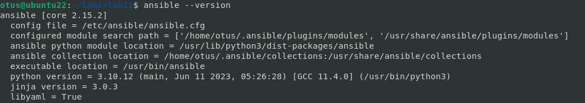

# Автоматизация администрирования. Ansible.

**Задачи:**

* Необходимо использовать модуль yum/apt

* Конфигурационные файлы должны быть взяты из шаблона jinja2 с переменными

* После установки nginx должен быть в режиме enabled в systemd

* Должен быть использован notify длā старта nginx после установки

* Сайт должен слушать на нестандартном порту - 8080, для этого использовать переменные в Ansible

* Сделать все это с использованием Ansible роли

**Домашнее задание считается принятым, если:**

* Предоставлен Vagrantfile и готовый playbook/роль ( инструкция по запуску
стенда, если посчитаете необходимым )

* После запуска стенда nginx доступен на порту 8080

* При написании playbook/роли соблюдены перечисленные в задании условия


**Решение:**

```
ansible --version
```



