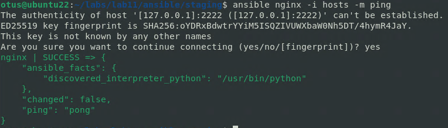

# Автоматизация администрирования. Ansible.

**Задачи:**

* Необходимо использовать модуль yum/apt

* Конфигурационные файлы должны быть взяты из шаблона jinja2 с переменными

* После установки nginx должен быть в режиме enabled в systemd

* Должен быть использован notify длā старта nginx после установки

* Сайт должен слушать на нестандартном порту - 8080, для этого использовать переменные в Ansible

* Сделать все это с использованием Ansible роли

**Домашнее задание считается принятым, если:**

* Предоставлен Vagrantfile и готовый playbook/роль ( инструкция по запуску
стенда, если посчитаете необходимым )

* После запуска стенда nginx доступен на порту 8080

* При написании playbook/роли соблюдены перечисленные в задании условия


**Решение:**

```
ansible --version
```

```
vagrant ssh-config
```

```
cd etc/ansible/
vim hosts
```

```
ansible nginx - hosts -m ping
```



```
vim ansible.cfg
```

```
vim hosts
```

```
ansible nginx -m ping
```


```
ansible nginx -m command -a "uname -r"
```


```
ansible nginx -m systemd -a name=firewalld
```


```
ansible nginx -m yum -a "name=epel-release state=present" -b
```


```
vim epel.yml
```

```
ansible-playbook epel.yml
```


```
ansible nginx -m yum -a "name=epel-release state=absent" -b
```
```
ansible-playbook epel.yml
```


```
vi NGINX.yml
```

```
ansible-playbook nginx.yml --list-tags
```


```
ansible-playbook nginx.yml -t nginx-package
```


```
vi nginx.yml
```

```
ansible-playbook nginx.yml
```


```
curl http://192.168.11.150:8080
```

