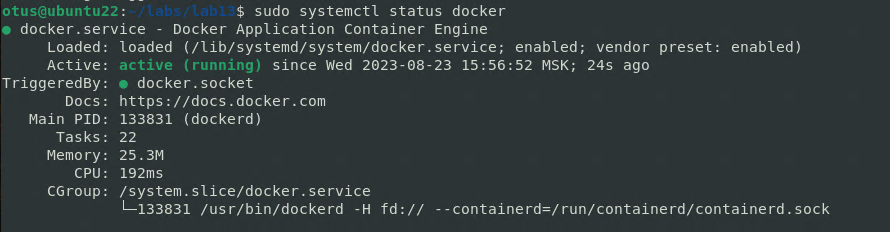
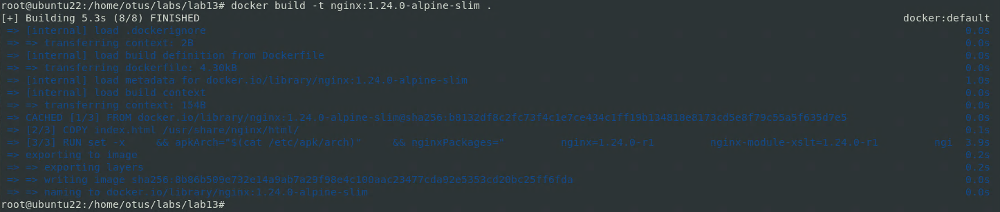
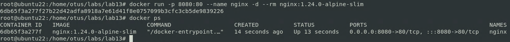

# Dockerfile

Создать свой кастомный образ nginx на базе alpine. После запуска nginx должен 
отдавать кастомную страницу (достаточно изменить дефолтную страницу nginx).
Определите разницу между контейнером и образом.
Вывод опишите в домашнем задании.
Ответьте на вопрос: Можно ли в контейнере собрать ядро?
Собранный образ необходимо запушить в docker hub и дать ссылку на ваш
репозиторий.

**Docker**

* Команды которые могут понадобиться:
    * docker ps
    * docker ps -a
    * docker run -d -p port:port container_name
    * docker stop container_name
    * docker logs container_name - вывод логов контейнеров
    * docker inspect container_name - информация по запущенному контейнеру
    * docker build -t dockerhub_login/reponame:ver
    * docker push/pull
    * docker exec -it container_name bash

* Что должно быть Dockerfile:
    * FROM image name
    * RUN apt update -y && apt upgrade -y
    * COPY или ADD filename /path/in/image
    * EXPOSE portopenning
    * CMD or ENTRYPOINT or both

#не забываем про разницу между COPY и ADD
#or - одна из опций на выбор

**Задание со * (звездочкой)**

Создайте кастомные образы nginx и php, объедините их в docker-compose.
После запуска nginx должен показывать php info.
Все собранные образы должны быть в docker hub

**Решение**

**Установим Docker**

```
sudo apt update
sudo apt install apt-transport-https ca-certificates curl software-properties-common
curl -fsSL https://download.docker.com/linux/ubuntu/gpg | sudo apt-key add -
sudo add-apt-repository "deb [arch=amd64] https://download.docker.com/linux/ubuntu focal stable"
sudo apt update
apt-cache policy docker-ce
sudo apt install docker-ce
sudo systemctl status docker
```


* Создадим кастомный образа nginx

    * За основу взят Dockerfile из https://github.com/nginxinc/docker-nginx/tree/master/stable/alpine

    * Создаём страницу index.html

```
vi index.html
```
```                                        
<html>
  <body>
    <h1>Otus2023</h1>
  </body>
</html>
```

* Добавляем инструкцию в DockerFile

```
COPY index.html /usr/share/nginx/html/
```

* Собираем образ
```
docker build -t nginx:1.24.0-alpine-slim .
```


* Запускаем образ
```
docker run -p 8080:80 --name nginx -d --rm nginx:1.24.0-alpine-slim
```
* Проверяем
```
docker ps
```



