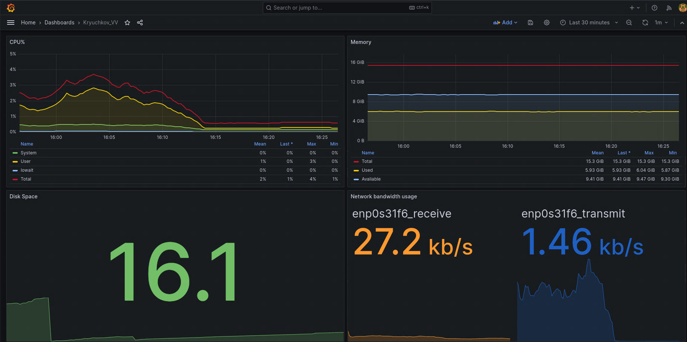

# Prometheus

**Цель домашнего задания**

узнать, из чего состоит экосистема Prometheus;
собирать и смотреть метрики

**Описание домашнего задания**

* Настроить дашборд с 4-мя графиками

    * память;
    * процессор;
    * диск;
    * сеть.
* Настроить на одной из систем:
    * zabbix (использовать screen (комплексный экран);
    * prometheus - grafana.

* Использование систем, примеры которых не рассматривались на занятии*
Список возможных систем был приведен в презентации.

**Решение**

