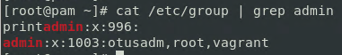

# Пользователи и группы. Авторизация и аутентификация 

**Цель домашнего задания**

Научиться создавать пользователей и добавлять им ограничения

**Описание домашнего задания**

1) Запретить всем пользователям, кроме группы admin, логин в выходные (суббота и воскресенье), без учета праздников

* дать конкретному пользователю права работать с докером и возможность рестартить докер сервис

**Решение**

```
Vagrant init centos/stream8
vim Vagrant
vagrant up
```

```
vagrant ssh
sudo -i
```

```
sudo useradd otusadm && sudo useradd otus
```

```
echo "Otus2022!" | sudo passwd --stdin otusadm && echo "Otus2022!" | sudo passwd --stdin otus
```


```
sudo groupadd -f admin
```

```
usermod otusadm -a -G admin && usermod root -a -G admin && usermod vagrant -a -G admin
```

```
ssh otus@192.168.57.10
```


```
cat /etc/group | grep admin
```


```
vi /usr/local/bin/login.sh
```

```
chmod +x /usr/local/bin/login.sh
```

```
vi /etc/pam.d/sshd 
account required pam_exec.so /usr/local/bin/login.sh
```

```
sudo date 082712302022.00
```

```
ssh otus@192.168.57.10
```

