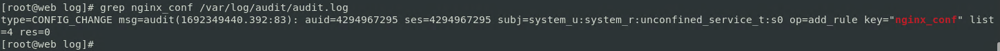
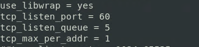

# Сбор и анализ логов

**Цель домашнего задания**

Научится проектировать централизованный сбор логов. Рассмотреть особенности разных платформ для сбора логов.

**Описание домашнего задания**

* В Vagrant разворачиваем 2 виртуальные машины web и log
* На web настраиваем nginx
* На log настраиваем центральный лог сервер на любой системе на выбор
    * journald
    * rsyslog
    * elk
* Настраиваем аудит, следящий за изменением конфигов nginx 

Все критичные логи с web должны собираться и локально и удаленно.
Все логи с nginx должны уходить на удаленный сервер (локально только критичные).
Логи аудита должны также уходить на удаленную систему.

Формат сдачи ДЗ - vagrant + ansible

* Дополнительное задание
    * развернуть еще машину с elk
    * таким образом настроить 2 центральных лог системы elk и какую либо еще;
    * в elk должны уходить только логи нжинкса;
    * во вторую систему все остальное.

**Решение**

**Создаём виртуальные машины**

```
vagrant init cenros/7
vi Vagrantfile
vagrant up
```

```
vagrant ssh web
sudo -i
cp /usr/share/zoneinfo/Europe/Moscow /etc/localtime
systemctl restart chronyd
systemctl status chronyd
```


```
yum install -y vim
```

```
vagrant ssh log
sudo -i
yum install -y vim
cp /usr/share/zoneinfo/Europe/Moscow /etc/localtime
systemctl restart chronyd
systemctl status chronyd
```


**Установка nginx на виртуальной машине web**

```
yum install epel-release 
```


```
yum install -y nginx
```


```
systemctl start nginx
systemctl status nginx
```


**Настройка центрального сервера сбора логов**

```
vagrant ssh log
sudo -i
yum list rsyslog
```


```
vi /etc/rsyslog.conf
```


```
sytemctl restart rsyslog
ss -tunl
```


```
vagrant ssh web
sudo -i
rpm -qa | grep nginx
```


```
vi etc/nginx/nginx.conf
```


```
nginx -t
```


```
reboot
```

```
rm /usr/share/nginx/html/img/header-background.png
```

```
cat /var/log/rsyslog/web/nginx_access.log
```


```
cat /var/log/rsyslog/web/nginx_error.log 
```


**Настройка аудита, контролирующего изменения конфигурации nginx**

```
rpm -qa | grep audit
```


```
vi /etc/audit/rules.d/audit.rules
```


```
service auditd restart
```

```
vi /etc/nginx/nginx.conf
grep nginx_conf /var/log/audit/audit.log
```


```
yum -y install audispd-plugins
```


```
vi /etc/audit/auditd.conf
```


```
vi /etc/audisp/plugins.d/au-remote.conf
```


```
vi /etc/audisp/audisp-remote.conf
```


```
vi /etc/audit/auditd.conf
```


```
service auditd restart
```


```
ls -l /etc/nginx/nginx.conf
chmod +x /etc//nginx/nginx.conf
ls -l /etc/nginx/nginx.conf
```


```
grep web /var/log/audit/audit.log
```


