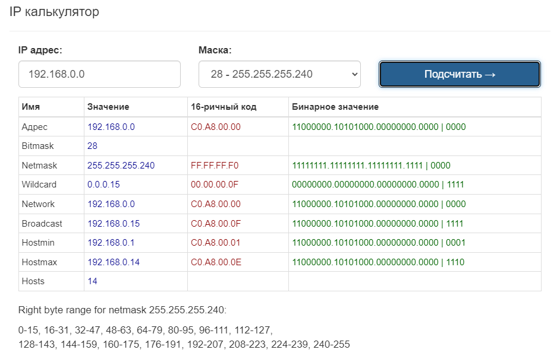

# Архитектура сетей

**Цель домашнего задания**

1. Скачать и развернуть Vagrant-стенд ()https://github.com/erlong15/otus-linux/tree/network
2. Построить следующую сетевую архитектуру:
Сеть office1:
- 192.168.2.0/26      - dev
- 192.168.2.64/26     - test servers
- 192.168.2.128/26    - managers
- 192.168.2.192/26    - office hardware

Сеть office2:
- 192.168.1.0/25      - dev
- 192.168.1.128/26    - test servers
- 192.168.1.192/26    - office hardware

Сеть central:
- 192.168.0.0/28     - directors
- 192.168.0.32/28    - office hardware
- 192.168.0.64/26    - wifi

Итого должны получиться следующие сервера:
- inetRouter
- centralRouter
- office1Router
- office2Router
- centralServer
- office1Server
- office2Server

**Решение**

Введение
Сеть — очень важная составляющая в работе серверов. По сети сервера взаимодействуют между собой. 

В данном домашнем задании мы рассмотрим технологии маршрутизации и NAT.

Маршрутизация — выбор оптимального пути передачи пакетов. Для маршрутизации используется таблица маршрутизации. 

Основная задача маршрутизации — доставить пакет по указанному IP-адресу. 

Если одно устройство имеет сразу несколько подсетей, например в сервере есть 2 порта с адресами:
1. 192.168.1.10/24
2. 10.10.12.72/24

то, такие сети называются непосредственно подключенными (Directly connected networks). Маршрутизация между Directly Connected сетями происходит автоматически. Дополнительная настройка не потребуется. 

Если необходимая сеть удалена, маршрутизатор будет искать через какой порт она будет доступна, если такой порт не найден, то трафик уйдет на шлюз по умолчанию. 

Маршрутизация бывает статическая и динамическая.

При использовании статической маршрутизации администратор сам создает правила для маршрутов. Плюсом данного метода будет являться безопасность, так как статические маршруты не обновляются по сети, а минусом — сложности при работе с сетями больших объёмов…

Динамическая маршрутизация подразумевает построение маршрутов автоматически с помощью различных протоколов (RIP,OSPF,BGP, и.т.д.). Маршрутизаторы сами обмениваются друг с другом информацией о сетях и автоматически прописывают маршруты.

NAT — это процесс, используемый для преобразования сетевых адресов. 

* Основные цели NAT:

    * Экономия публичных IPv4-адресов 
    * Повышение степени конфиденциальности и безопасности сети. 

NAT обычно работает на границе, где локальная сеть соединяется с сетью Интернет. Когда устройству сети потребуется подключение к устройству вне его сети (например в Интернете), пакет пересылается маршрутизатору с NAT, а маршрутизатор преобразовывает его внутренний адрес в публичный.

1. Теоретическая часть

* В теоретической части нам необходимо продумать топологию сети, а также:
    * Найти свободные подсети
    * Посчитать количество узлов в каждой подсети, включая свободные
    * Указать Broadcast-адрес для каждой подсети
    * Проверить, нет ли ошибок при разбиении

Первым шагом мы рассмотрим все сети, указанные в задании. Посчитаем для них количество узлов, найдём Broadcast-адрес, проверим, нет ли ошибок при разбиении.

Расчеты можно выполнить вручную, или воспользоваться калькулятором сетей. Для примера, посчитаем одну подсеть вручную:

У нас есть сеть directors 192.168.0.0/28
192.168.0.0 — это сама сеть, 28 — это маска. Маска показывает нам, границы сети 192.168.0.0. Маска может быть записана в 2-х видах: 
1) /28
2) 255.255.255.240

Пример перевода маски /28 в формат 255.255.255.240:

Маска Ipv4-адреса — это 4 октета, т.е. 4 блока по 8 цифр (1 или 0). 
/28 — это 28 единиц с начала маски: 11111111.11111111.11111111.11110000  
Всегда при разбиении сетей, после знака / указывается количество единиц с начала маски.

11111111.11111111.11111111.11110000 — это двоичный код маски, если мы переведем данное значение в десятичную систему счисления, то получим 255.255.255.240

Далее посчитаем количество устройств в сети: 
Количество устройств в сети рассчитывается по формуле = 232−маска−2
Таким образом, количество устройств для подсети /28 будет = 232−28−2=16−2=14

Цифра 2 вычитается, так как:
Первый адрес (192.168.0.0) — это наименование подсети, его нельзя задать устройству
Последний адрес (192.168.0.15) — это всегда broadcast-адрес. Broadcast-адрес нужен для рассылки всем устройствам сети. 

Таким образом мы можем сформировать таблицу топологии нашей сети

| Сеть          | Маска              | Кол-во адресов        | Первый адрес в сети| Последний адрес в сети | Broadcast — адрес      |
| :-------------|:------------------ | :---------------------|:-------------------|:-----------------------| :----------------------|
| 192.168.0.0/28| 255.255.255.240    | 14                    | 192.168.0.1        | 192.168.0.14           | 192.168.0.15           |

По такому примеру нужно рассчитать остальные сети. Для проверки себя можно использовать калькулятор масок, например, этот - https://ip-calculator.ru/ 

Для того, чтобы получить всю информацию по сети, потребуется указать ip-адрес и маску, например:

После расчета всех сетей, мы должны получить следующую таблицу топологии:

<table class="tg">
<thead>
  <tr>
    <th class="tg-0pky">Name</th>
    <th class="tg-0pky">Network</th>
    <th class="tg-0pky">Netmask</th>
    <th class="tg-0pky">N</th>
    <th class="tg-0pky">Hostmin</th>
    <th class="tg-0pky">Hostmax</th>
    <th class="tg-0pky">Broadcast</th>
  </tr>
</thead>
<tbody>
  <tr>
    <td class="tg-7btt" colspan="7">Central Network</td>
  </tr>
  <tr>
    <td class="tg-0pky">Directors</td>
    <td class="tg-0pky">192.168.0.0/28</td>
    <td class="tg-0pky">255.255.255.240</td>
    <td class="tg-0pky">14</td>
    <td class="tg-0pky">192.168.0.1</td>
    <td class="tg-0pky">192.168.0.14</td>
    <td class="tg-0pky">192.168.0.15</td>
  </tr>
  <tr>
    <td class="tg-0pky">Office hardware</td>
    <td class="tg-0pky">192.168.0.32/28</td>
    <td class="tg-0pky">255.255.255.240</td>
    <td class="tg-0pky">14</td>
    <td class="tg-0pky">192.168.0.33</td>
    <td class="tg-0pky">192.168.0.46</td>
    <td class="tg-0pky">192.168.0.47</td>
  </tr>
  <tr>
    <td class="tg-0lax">Wifi(mgt network)</td>
    <td class="tg-0lax">192.168.0.64/26</td>
    <td class="tg-0lax">255.255.255.192</td>
    <td class="tg-0lax">62</td>
    <td class="tg-0lax">192.168.0.65</td>
    <td class="tg-0lax">192.168.0.126</td>
    <td class="tg-0lax">192.168.0.127</td>
  </tr>
  <tr>
    <td class="tg-amwm" colspan="7">Office 1 network</td>
  </tr>
  <tr>
    <td class="tg-0lax">Dev</td>
    <td class="tg-0lax">192.168.2.0/26</td>
    <td class="tg-0lax">255.255.255.192</td>
    <td class="tg-0lax">62</td>
    <td class="tg-0lax">192.168.2.1</td>
    <td class="tg-0lax">192.168.2.62</td>
    <td class="tg-0lax">192.168.2.63</td>
  </tr>
  <tr>
    <td class="tg-0lax">Test</td>
    <td class="tg-0lax">192.168.2.64/26</td>
    <td class="tg-0lax">255.255.255.192</td>
    <td class="tg-0lax">62</td>
    <td class="tg-0lax">192.168.2.65</td>
    <td class="tg-0lax">192.168.2.126</td>
    <td class="tg-0lax">192.168.2.127</td>
  </tr>
  <tr>
    <td class="tg-0lax">Managers</td>
    <td class="tg-0lax">192.168.2.128/26</td>
    <td class="tg-0lax">255.255.255.192</td>
    <td class="tg-0lax">62</td>
    <td class="tg-0lax">192.168.2.129</td>
    <td class="tg-0lax">192.168.2.190</td>
    <td class="tg-0lax">192.168.2.191</td>
  </tr>
  <tr>
    <td class="tg-0lax">Office hardware</td>
    <td class="tg-0lax">192.168.2.192/26</td>
    <td class="tg-0lax">255.255.255.192</td>
    <td class="tg-0lax">62</td>
    <td class="tg-0lax">192.168.2.193</td>
    <td class="tg-0lax">192.168.2.254</td>
    <td class="tg-0lax">192.168.2.255</td>
  </tr>
  <tr>
    <td class="tg-amwm" colspan="7">Office 2 network</td>
  </tr>
  <tr>
    <td class="tg-0lax">Dev</td>
    <td class="tg-0lax">192.168.1.0/25</td>
    <td class="tg-0lax">255.255.255.128</td>
    <td class="tg-0lax">126</td>
    <td class="tg-0lax">192.168.1.1</td>
    <td class="tg-0lax">192.168.1.126</td>
    <td class="tg-0lax">192.168.1.127</td>
  </tr>
  <tr>
    <td class="tg-0lax">Test</td>
    <td class="tg-0lax">192.168.1.128/26</td>
    <td class="tg-0lax">255.255.255.192</td>
    <td class="tg-0lax">62</td>
    <td class="tg-0lax">192.168.1.129</td>
    <td class="tg-0lax">192.168.1.190</td>
    <td class="tg-0lax">192.168.1.191</td>
  </tr>
  <tr>
    <td class="tg-0lax">Office</td>
    <td class="tg-0lax">192.168.1.192/26</td>
    <td class="tg-0lax">255.255.255.192</td>
    <td class="tg-0lax">62</td>
    <td class="tg-0lax">192.168.1.193</td>
    <td class="tg-0lax">192.168.1.254</td>
    <td class="tg-0lax">192.168.1.255</td>
  </tr>
  <tr>
    <td class="tg-amwm" colspan="7">InetRouter — CentralRouter network</td>
  </tr>
  <tr>
    <td class="tg-0lax">Inet — central</td>
    <td class="tg-0lax">192.168.255.0/30</td>
    <td class="tg-0lax">255.255.255.252</td>
    <td class="tg-0lax">2</td>
    <td class="tg-0lax">192.168.255.1</td>
    <td class="tg-0lax">192.168.255.2</td>
    <td class="tg-0lax">192.168.255.3</td>
  </tr>
</tbody>
</table>

После создания таблицы топологии, мы можем заметить, что ошибок в задании нет, также мы сразу видим следующие свободные сети: 

- 192.168.0.16/28 
- 192.168.0.48/28
- 192.168.0.128/25
- 192.168.255.64/26
- 192.168.255.32/27
- 192.168.255.16/28
- 192.168.255.8/29  
- 192.168.255.4/30 

2. Практическая часть

