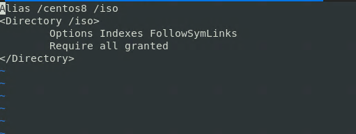
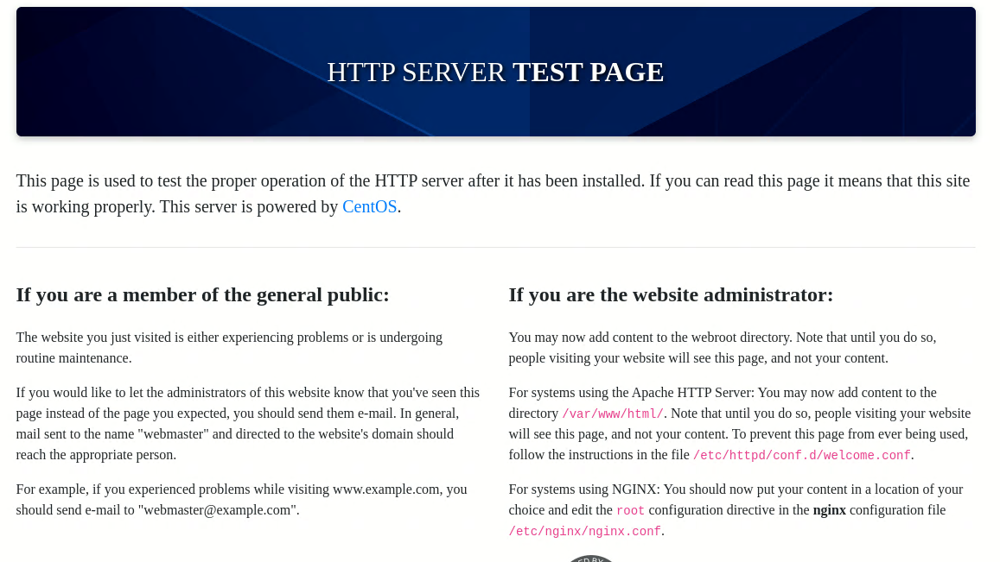
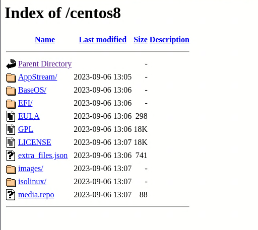
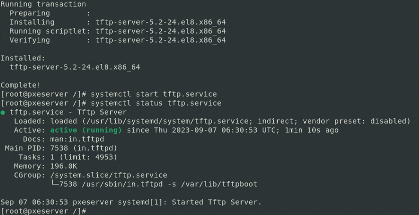
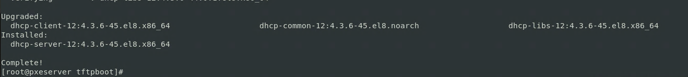
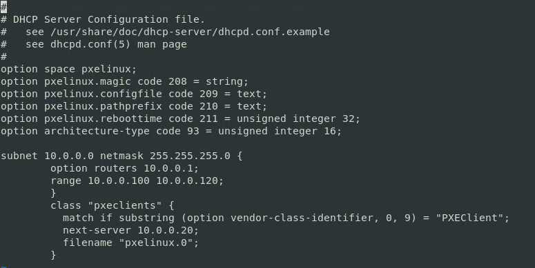
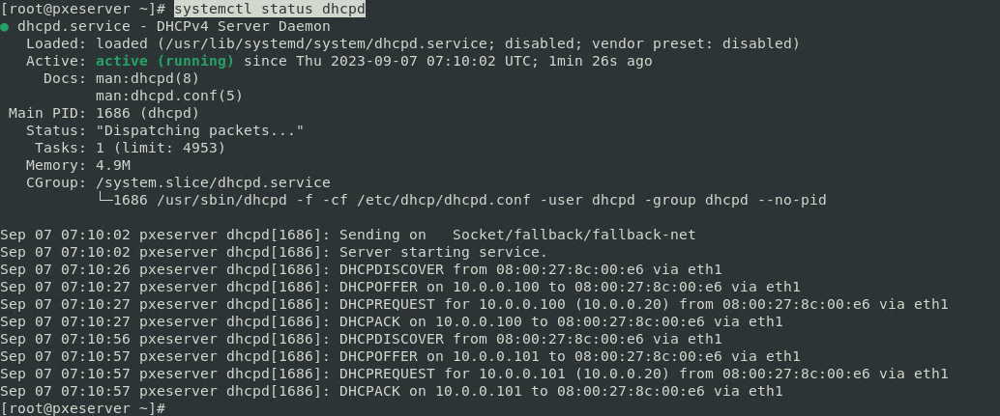
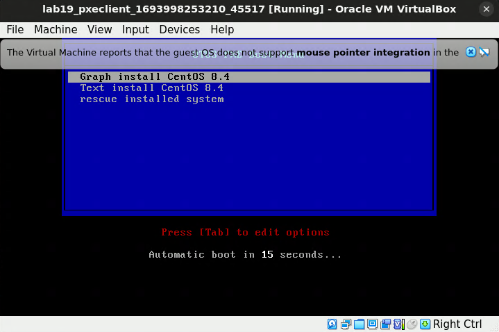
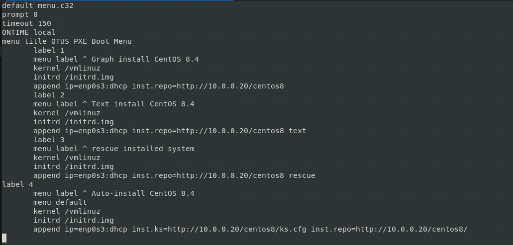

# Vagrant-стенд c PXE

**Цель домашнего задания**

Отработать навыки установки и настройки DHCP, TFTP, PXE загрузчика и автоматической загрузки

**Описание домашнего задания**

* Следуя шагам из документа https://docs.centos.org/en-US/8-docs/advanced-install/assembly_preparing-for-a-network-install  установить и настроить загрузку по сети для дистрибутива CentOS 8. В качестве шаблона воспользуйтесь репозиторием https://github.com/nixuser/virtlab/tree/main/centos_pxe 
* Поменять установку из репозитория NFS на установку из репозитория HTTP.
* Настроить автоматическую установку для созданного kickstart файла (*) Файл загружается по HTTP.

Задание со звездочкой *
* автоматизировать процесс установки Cobbler cледуя шагам из документа https://cobbler.github.io/quickstart/. 

**Решение**

1. Работа с шаблоном из задания

После внесения всех изменений запускаем стэнд

```
vagrant up
```


* Для настроки хоста с помощью Ansible нам нужно создать несколько файлов и положить их в отдельную папку (в моём примере имя папки ansible)

```
mkdir ansible
cd ansible
vi ansible.cfg
vi hosts
vi Ansible-playbook provision.yml
mkdir templates
mkdir defaults
```

* Настройка Web-сервера

```
vagrant ssh pxeserver
sudo -i
```
```
sed -i 's/mirrorlist/#mirrorlist/g' /etc/yum.repos.d/CentOS-Linux-*
sed -i 's|#baseurl=http://mirror.centos.org|baseurl=http://vault.centos.org|g' /etc/yum.repos.d/CentOS-Linux-*
```

```
yum install httpd
```


```
wget --no-check-certificate https://mirror.sale-dedic.com/centos/8-stream/isos/x86_64/CentOS-Stream-8-20230904.0-x86_64-dvd1.iso
```
```
mount -t iso9660 CentOS-Stream-8-20230904.0-x86_64-dvd1.iso /mnt -o loop,ro
```
```
mkdir /iso
cp -r /mnt/* /iso
chmod -R 755 /iso
```

```
vi /etc/httpd/conf.d/pxeboot.conf
```


```
systemctl restart httpd
systemctl enable httpd
```



* Настройка TFTP-сервера

```
yum install tftp-server
systemctl start tftp.service
```


```
mkdir /var/lib/tftpboot/pxelinux.cfg
vi /var/lib/tftpboot/pxelinux.cfg/default
```

```
rpm2cpio /iso/BaseOS/Packages/syslinux-tftpboot-6.04-6.el8.noarch.rpm | cpio -dimv
```

```
cd tftpboot
cp pxelinux.0 ldlinux.c32 libmenu.c32 libutil.c32 menu.c32 vesamenu.c32 /var/lib/tftpboot/
cp /iso/images/pxeboot/{initrd.img,vmlinuz} /var/lib/tftpboot/
```

```
systemctl restart tftp.service
systemctl enable tftp.service
```

* Настройка DHCP-сервера

```
yum install dhcp-server
```


```
vi /etc/dhcp/dhcpd.conf
```


```
systemctl status dhcpd
```




* Настройка автоматической установки с помощью Kickstart-файла

```
vi /iso/ks.cfg
```


```
vi /var/lib/tftpboot/pxelinux.cfg/default 
```



