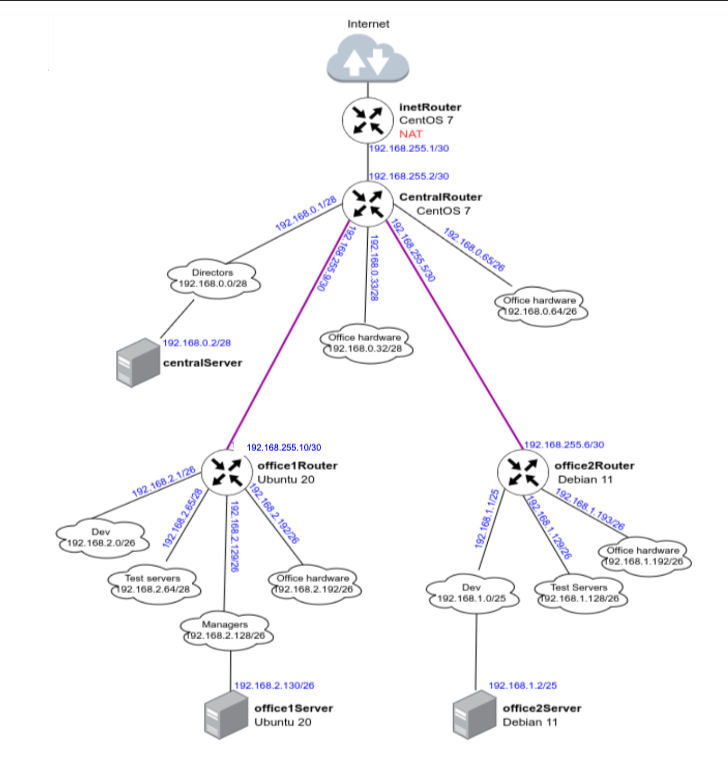
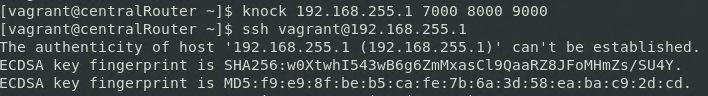

# Фильтрация трафика - firewalld, iptables

**Цель домашнего задания**

Сценарии iptables

**Описание домашнего задания**

* реализовать knocking port (centralRouter может попасть на ssh inetrRouter через knock)
* добавить inetRouter2, который виден (маршрутизируется (host-only тип сети для виртуалки)) с хоста или форвардится порт через локалхост
* запустить nginx на centralServer
* пробросить 80й порт на inetRouter2 8080
* дефолт в инет оставить через inetRouter

**Решение**

**Схема сети**



Проверка работоспособности knocking port

```
vagrant ssh centralRouter
```

```
ssh vagrant@192.168.255.1
```


```
knock 192.168.255.1 7000 8000 9000
ssh vagrant@192.168.255.1
```



