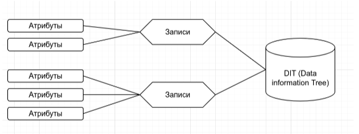

# LDAP

## Цель домашнего задания

Научиться настраивать LDAP-сервер и подключать к нему LDAP-клиентов

## Описание домашнего задания

- Установить FreeIPA
- Написать Ansible-playbook для конфигурации клиента

Дополнительное задание:

- Настроить аутентификацию по SSH-ключам
- Firewall должен быть включен на сервере и на клиенте

## Введение

LDAP (Lightweight Directory Access Protocol — легковесный протокол доступа к каталогам) —  это протокол для хранения и получения данных из каталога с иерархической структурой.
LDAP не является протоколом аутентификации или авторизации 

С увеличением числа серверов затрудняется управление пользователями на этих сервере. LDAP решает задачу централизованного управления доступом. 
С помощью LDAP можно синхронизировать:
- UID пользователей
- Группы (GID)
- Домашние каталоги
- Общие настройки для хостов 
- И т. д. 

LDAP работает на следующих портах: 
- 389/TCP — без TLS/SSL
- 636/TCP — с TLS/SSL

Основные компоненты LDAP



- Атрибуты — пара «ключ-значение». Пример атрибута: mail: admin@example.com
- Записи (entry) — набор атрибутов под именем, используемый для описания чего-либо

Пример записи:
```bash
dn: sn=Ivanov, ou=people, dc=digitalocean,dc=com
objectclass: person
sn: Ivanov
cn: Ivan Ivanov
```

- Data Information Tree (DIT) — организационная структура, где каждая запись имеет ровно одну родительскую запись и под ней может находиться любое количество дочерних записей. Запись верхнего уровня — исключение

На основе LDAP построенно много решений, например: Microsoft Active Directory, OpenLDAP, FreeIPA и т. д.

В данной лабораторной работе будет рассмотрена установка и настройка FreeIPA. FreeIPA — это готовое решение, включающее в себе:
- Сервер LDAP на базе Novell 389 DS c предустановленными схемами
- Сервер Kerberos
- Предустановленный BIND с хранилищем зон в LDAP
- Web-консоль управления

## Решение

- Написан Ansible [playbook](./ansible/provision.yml) для конфигурации сервера и клиента
- Настроена аутентификация по SSH-ключам
- Firewall включен на сервере и на клиенте

Развертывание:

```bash
vagant up --no-provision
vagrant provision ipaserver
```

Проверка подключения созданного пользователя:

```bash
vagrant ssh ipaclient 
Last login: Wen Nov 08 19:20:03 2023 from 10.0.2.2
[vagrant@ipaclient ~]$ ssh test_user@localhost
Creating home directory for test_user.
[test_user@ipaclient ~]$
```
