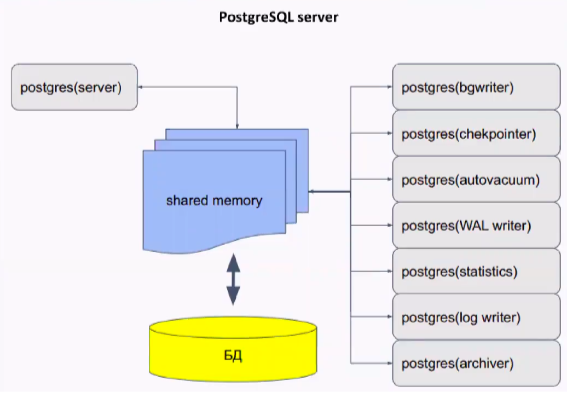

# Vagrant-стенд c Postgres

## Цели домашнего задания

Научиться настраивать репликацию и создавать резервные копии в СУБД PostgreSQL

## Описание домашнего задания

1) Настроить hot_standby репликацию с использованием слотов
2) Настроить правильное резервное копирование

пример плейбука:

```bash
- name: Установка postgres11
  hosts: master, slave
  become: yes
  roles:
   - postgres_install

- name: Настройка master
  hosts: master
  become: yes
  roles:
   - master-setup
```

## Введение

PostgreSQL — свободная объектно-реляционная система управления базами данных (СУБД). 
Основные термины в Postgres:
**Кластер** - объединение нескольких баз данных. В postgres это означает что на одном хосте создаётся несколько баз сразу. 
**База данных** - физическое объединение объектов
**Схема** - логическое объединение таблиц в базе данных. По умолчанию в postgres создаётся одна схема под названием Public
**По умолчанию в кластере находятся:**
- **template0** - read only БД, содержащая инициализационный набор данных
- **template1** - база-шаблон для создания новых баз
- **postgres** (при желании можно поменять название). В базе находятся служебные таблицы, можно также использовать данную базу для своих нужд, но это не рекомендуется.

Управлять базами, таблицами и данными можно не только с помощью консольной утилиты psql, но и с помощью GUI-утилит, например pgAdmin, Dbeaver  и т. д.

Postgres - это мультироцессное приложение. Состоит из главного процесса (postgres), который отвечает за подключение клиентов, взаимодействие с кэшом и отвечает за остальные процессы (background processes).



Основные конфигурационные файлы в Postgres: 
* **pg_hba.conf** -  файл задаёт способ доступа к базам и репликации из различных источников.
* **postgresql.conf** - файл конфигурации, обычно находится в каталоге данных, может редактироваться вручную. Может быть несколько значений одного и того же параметра, тогда вступает в силу последнее значение.
* **postgresql.auto.conf** - предназначен для автоматического изменения параметров postgres

**WAL (Write Ahead Log)** - журнал упреждающей записи
В WAL записывается информация, достаточная для повторного выполнения всех действий с БД.
Записи этого журнала обязаны попасть на диск раньше, чем изменения в соответствующей странице. Журнал состоит из нескольких файлов (обычно по 16МБ), которые циклически перезаписываются.

**Репликация** - процесс синхронизации нескольких копий одного объекта. Решает задачу отказоустойчивости и масштабируемости.

**Задачи репликации:**
* балансировка нагрузки
* резервирование (НЕ БЭКАП, бэкап можно делать с реплики)
* обновление без остановки системы
* горизонтальное масштабирование
* геораспределение нагрузки

**Виды репликации:**
* **Физическая репликация** - описание изменений на уровне файлов. Побайтовая копия данных.
* **Логическая репликация** - изменения данных в терминах строк таблиц. Более высокий уровень, чем файлы

Помимо репликации, рекомендуется создавать резервные копии. Они могут потребоваться, если вдруг сервера СУБД выйдут из строя. 

## Решение

Создадим Vagrantfile, в котором будут указаны параметры наших ВМ:

```bash
# Описание параметров ВМ
MACHINES = {
  # Имя DV "pam"
  :node1 => {
        # VM box
        :box_name => "centos/stream8",
        # Имя VM
        :vm_name => "node1",
        # Количество ядер CPU
        :cpus => 2,
        # Указываем количество ОЗУ (В Мегабайтах)
        :memory => 1024,
        # Указываем IP-адрес для ВМ
        :ip => "192.168.57.11",
  },
  :node2 => {
        :box_name => "centos/stream8",
        :vm_name => "node2",
        :cpus => 2,
        :memory => 1024,
        :ip => "192.168.57.12",

  },
  :barman => {
        :box_name => "centos/stream8",
        :vm_name => "barman",
        :cpus => 1,
        :memory => 1024,
        :ip => "192.168.57.13",

  },

}

Vagrant.configure("2") do |config|

  MACHINES.each do |boxname, boxconfig|
    
    config.vm.define boxname do |box|
   
      box.vm.box = boxconfig[:box_name]
      box.vm.host_name = boxconfig[:vm_name]
      box.vm.network "private_network", ip: boxconfig[:ip]
      box.vm.provider "virtualbox" do |v|
        v.memory = boxconfig[:memory]
        v.cpus = boxconfig[:cpus]
      end

      # Запуск ansible-playbook
      if boxconfig[:vm_name] == "barman"
       box.vm.provision "ansible" do |ansible|
        ansible.playbook = "ansible/provision.yml"
        ansible.inventory_path = "ansible/hosts"
        ansible.host_key_checking = "false"
        ansible.limit = "all"
       end
      end
    end
  end
end
```

После создания Vagrantfile запустим наши ВМ командой vagrant up. Будет создано три виртуальных машины.

```bash
vagrant up
```

На всех хостах предварительно должны быть выключены firewalld и SElinux:
- Отключаем службу firewalld:  ```systemctl stop firewalld```
- Удаляем службу из автозагрузки: ```systemctl disable firewalld```
- Отключаем SElinux: ```setenforce 0```
- Правим параметр SELINUX=disabled в файле /etc/selinux/config 

Для удобства на все хосты можно установить текстовый редактор vim и утилиту telnet: 
```bash 
yum install -y vim telnet
```

Команды должны выполняться от root-пользователя
Для перехода в root-пользователя вводим sudo -i

**Настройка hot_standby репликации с использованием слотов**

Перед настройкой репликации необходимо установить postgres-server на хосты node1 и node2:

1) Добавим postgres репозиторий: ```sudo dnf install -y https://download.postgresql.org/pub/repos/yum/reporpms/EL-8-x86_64/pgdg-redhat-repo-latest.noarch.rpm```
2) Исключаем старый postgresql модуль: ```yum -qy module disable postgresql```
3) Устанавливаем postgresql-server 14: ```yum install -y postgresql14-server```
4) Выполняем инициализацию кластера: ```sudo /usr/pgsql-14/bin/postgresql-14-setup initdb```
5) Запускаем postgresql-server: ```systemctl start postgresql-14```
6) Добавляем postgresql-server в автозагрузку:  ```systemctl enable postgresql-14```

Далее приступаем к настройке репликации: 

**На хосте node1:**
1) Заходим в psql

```bash
[root@node1 ~]# sudo -u postgres psql
could not change directory to "/root": Permission denied
psql (14.10)
Type "help" for help.

postgres=# 
```

2) В psql создаём пользователя replicator c правами репликации и паролем «Otus2022!»

```bash
CREATE USER replicator WITH REPLICATION Encrypted PASSWORD 'Otus2022!'
```

3) В файле **/var/lib/pgsql/14/data/postgresql.conf** указываем следующие параметры:

```bash
#Указываем ip-адреса, на которых postgres будет слушать трафик на порту 5432 (параметр port)
listen_addresses = 'localhost, 192.168.57.11'
#Указываем порт порт postgres
port = 5432 
#Устанавливаем максимально 100 одновременных подключений
max_connections = 100
log_directory = 'log' 
log_filename = 'postgresql-%a.log' 
log_rotation_age = 1d 
log_rotation_size = 0 
log_truncate_on_rotation = on 
max_wal_size = 1GB
min_wal_size = 80MB
log_line_prefix = '%m [%p] ' 
#Указываем часовой пояс для Москвы
log_timezone = 'UTC+3'
timezone = 'UTC+3'
datestyle = 'iso, mdy'
lc_messages = 'en_US.UTF-8'
lc_monetary = 'en_US.UTF-8' 
lc_numeric = 'en_US.UTF-8' 
lc_time = 'en_US.UTF-8' 
default_text_search_config = 'pg_catalog.english'
#можно или нет подключаться к postgresql для выполнения запросов в процессе восстановления; 
hot_standby = on
#Включаем репликацию
wal_level = replica
#Количество планируемых слейвов
max_wal_senders = 3
#Максимальное количество слотов репликации
max_replication_slots = 3
#будет ли сервер slave сообщать мастеру о запросах, которые он выполняет.
hot_standby_feedback = on
#Включаем использование зашифрованных паролей
password_encryption = scram-sha-256
```

4) Настраиваем параметры подключения в файле **/var/lib/pgsql/14/data/pg_hba.conf:**

```bash
# TYPE  DATABASE        USER            ADDRESS                 METHOD
# "local" is for Unix domain socket connections only
local   all                  all                                                peer
# IPv4 local connections:
host    all                  all             127.0.0.1/32              scram-sha-256
# IPv6 local connections:
host    all                  all             ::1/128                       scram-sha-256
# Allow replication connections from localhost, by a user with the
# replication privilege.
local   replication      all                                                peer
host    replication     all             127.0.0.1/32               scram-sha-256
host    replication     all             ::1/128                        scram-sha-256
host    replication replication    192.168.57.11/32        scram-sha-256
host    replication replication    192.168.57.12/32        scram-sha-256
```

Две последние строки в файле разрешают репликацию пользователю replication. 

5) Перезапускаем postgresql-server: ```systemctl restart postgresql-14.service```

**На хосте node2:**

1) Останавливаем postgresql-server: ```systemctl stop postgresql-14.service```
2) С помощью утилиты pg_basebackup копируем данные с node1: ```pg_basebackup -h 192.168.57.11 -U    /var/lib/pgsql/14/data/ -R -P```
3) В файле  var/lib/pgsql/14/data/postgresql.conf меняем параметр: ```listen_addresses = 'localhost, 192.168.57.12' ```
4) Запускаем службу postgresql-server: systemctl ```start postgresql-14.service```

Проверка репликации: 
На хосте node1 в psql создадим базу otus_test и выведем список БД: 

```
sudo -u postgres psql
```

```bash
postgres=# CREATE DATABASE otus_test;
CREATE DATABASE
postgres=# \l
                                  List of databases
   Name    |  Owner   | Encoding |   Collate   |    Ctype    |   Access privileges   
-----------+----------+----------+-------------+-------------+-----------------------
 otus_test | postgres | UTF8     | en_US.UTF-8 | en_US.UTF-8 | 
 postgres  | postgres | UTF8     | en_US.UTF-8 | en_US.UTF-8 | 
 template0 | postgres | UTF8     | en_US.UTF-8 | en_US.UTF-8 | =c/postgres          +
           |          |          |             |             | postgres=CTc/postgres
 template1 | postgres | UTF8     | en_US.UTF-8 | en_US.UTF-8 | =c/postgres          +
           |          |          |             |             | postgres=CTc/postgres
(4 rows)

postgres=# 
```

На хосте node2 также в psql также проверим список БД (команда \l), в списке БД должна появится БД otus_test. 

```bash
postgres=# \l
                                  List of databases
   Name    |  Owner   | Encoding |   Collate   |    Ctype    |   Access privileges   
-----------+----------+----------+-------------+-------------+-----------------------
 otus_test | postgres | UTF8     | en_US.UTF-8 | en_US.UTF-8 | 
 postgres  | postgres | UTF8     | en_US.UTF-8 | en_US.UTF-8 | 
 template0 | postgres | UTF8     | en_US.UTF-8 | en_US.UTF-8 | =c/postgres          +
           |          |          |             |             | postgres=CTc/postgres
 template1 | postgres | UTF8     | en_US.UTF-8 | en_US.UTF-8 | =c/postgres          +
           |          |          |             |             | postgres=CTc/postgres
(4 rows)

postgres=# 
```

**Настройка hot_standby репликации с использованием слотов с помощью ansible**

В каталоге с нашей лабораторной работой создадим каталог Ansible: mkdir ansible
В каталоге ansible создадим файл hosts со следующими параметрами:

```bash
[servers]
node1 ansible_host=192.168.57.11 ansible_user=vagrant ansible_ssh_private_key_file=./.vagrant/machines/node1/virtualbox/private_key 
node2 ansible_host=192.168.57.12 ansible_user=vagrant ansible_ssh_private_key_file=./.vagrant/machines/node2/virtualbox/private_key 
barman ansible_host=192.168.57.13 ansible_user=vagrant ansible_ssh_private_key_file=./.vagrant/machines/barman/virtualbox/private_key 
```

Файл содержит группу servers в которой прописаны 3 хоста: 
- node1
- node2
- barman
Также указаны и ip-адреса, имя пользователя от которого будет логин и ssh-ключ.

Далее создадим файл provision.yml в котором непосредственно будет выполняться настройка клиентов: 
```bash
- name: Postgres
  hosts: all
  become: yes
  tasks:
  #Устанавливаем vim и telnet (для более удобной работы с хостами)
  - name: install base tools
    dnf:
      name:
        - vim
        - telnet
      state: present
      update_cache: true

#Запуск ролей install_postgres и postgres_replication на хостах node1 и node2
- name: install postgres 14 and set up replication
  hosts: node1,node2
  become: yes
  roles:
   - install_postgres
   - postgres_replication

#Запуск роли install_barman на всех хостах
- name: set up backup
  hosts: all
  become: yes
  roles:
   - install_barman
```

В файле provision.yml мы видим модули запуска ролей. Для того, чтобы создать роль, находясь в каталоге ansible, нужно ввести команду: ansible-galaxy init <имя_роли> 
После выполнения команды в каталоге ansible будет создан каталог с именем роли, в нём автоматически будут созданны каталоги. Рассмотрим каталоги, которые будут использоваться в нашей методичке: 
- **defaults** — каталог, в котором могут находится дефолтные значения
- **tasks** — каталог, в котором содержатся ansible плейбуки, первым всегда запускается плейбук с именем main.yml
- **templates** — каталог в котором содержатся черновики, которые будут использоваться в настройке конфигурации
- **README.md** — файл-руководство,  в нём обычно указана важная информация о роли и/или пример запуска
Более подробно изучить информацию о ролях можно в документации Ansible.

Для настройки репликации у нас используются 2 роли: 
- install_postgres
- postgres_replication

Создадим роль install_postgres: ```ansible-galaxy init install_postgres```

В каталоге tasks создаём файл main.yml и добавляем в него следующее содержимое: 

```bash
---
# Отключаем firewalld и удаляем его из автозагрузки
  - name: disable firewalld service
    service:
      name: firewalld
      state: stopped
      enabled: false
  
  # Отключаем SElinux 
  - name: Disable SELinux
    selinux:
      state: disabled
  
  # Отключаем SElinux после перезагрузки
  - name: Ensure SELinux is set to disable mode
    lineinfile:
      path: /etc/selinux/config
      regexp: '^SELINUX='
      line: SELINUX=disabled

  # Добавляем репозиторий postgres
  - name: install repo
    dnf:
      name: 'https://download.postgresql.org/pub/repos/yum/reporpms/EL-8-x86_64/pgdg-redhat-repo-latest.noarch.rpm'
      state: present
  
  # Отключаем старый модуль
  - name: disable old postgresql module
    shell: dnf -qy module disable postgresql
  
  # Устанавливаем postgresql14-server
  - name: install postgresql-server 14
    dnf: 
      name: postgresql14-server
      state: present
      update_cache: true
  
  # Проверяем, что postgres на хосте ещё не инициализирован
  - name: check init 
    stat:
      path: /var/lib/pgsql/14/data/pg_stat
    register: stat_result

  # Выполняем инициализацию postgres
  - name: initialization setup
    shell: sudo /usr/pgsql-14/bin/postgresql-14-setup initdb
    when: not stat_result.stat.exists
  
  # Запускаем postgresql-14
  - name: enable and start service
    service:
      name: postgresql-14
      state: started
      enabled: true
```

Далее, создаём роль **postgres_replication**: ```ansible-galaxy init postgres_replication```

В каталоге defaults создаём файл main.yml со следующими переменными: 

---
# defaults file for postgres_replicationz
replicator_password: 'Otus2022!'
master_ip: '192.168.57.11'
slave_ip: '192.168.57.12'

Данные переменные требуются для темплейтов и выполнения некоторых модулей. 

В каталоге templates создадим файлы: 
- pg_hba.conf.j2
- postgresql.conf.j2
Содержимое файлов было представлено ранее в методичке, так как мы используем темплейты, вместо ip-адресов будут указанные переменные из файла **defaults/main.yml**

В каталоге tasks создаём файл main.yml со следующим содержимым: 

```bash
---
# Установка python-пакетов для модулей psql
  - name: install base tools
    dnf:
      name:
        - python3-pexpect.noarch
        - python3-psycopg2
      state: present
      update_cache: true

#CREATE USER replicator WITH REPLICATION Encrypted PASSWORD 'Otus2022!';
  - name: Create replicator user
    become_user: postgres
    postgresql_user:
      name: replication
      password: '{{ replicator_password }}'
      role_attr_flags: REPLICATION 
    ignore_errors: true
    when: (ansible_hostname == "node1")

  #Остановливаем postgresql-14 на хосте node2
  - name: stop postgresql-server on node2
    service: 
      name: postgresql-14
      state: stopped
    when: (ansible_hostname == "node2")

  #Копиуем конфигурационный файл postgresql.conf
  - name: copy postgresql.conf
    template:
      src: postgresql.conf.j2
      dest: /var/lib/pgsql/14/data/postgresql.conf
      owner: postgres
      group: postgres
      mode: '0600'
    when: (ansible_hostname == "node1")
  
  #Копиуем конфигурационный файл pg_hba.conf
  - name: copy pg_hba.conf
    template:
      src: pg_hba.conf.j2
      dest: /var/lib/pgsql/14/data/pg_hba.conf
      owner: postgres
      group: postgres
      mode: '0600'
    when: (ansible_hostname == "node1")
   #Перезапускаем службу  postgresql-14
  - name: restart postgresql-server on node1
    service: 
      name: postgresql-14
      state: restarted
    when: (ansible_hostname == "node1")

  #Удаляем содержимое каталога /var/lib/pgsql/14/data/
  - name: Remove files from data catalog
    file:
      path: /var/lib/pgsql/14/data/
      state: absent
    when: (ansible_hostname == "node2")

  #Копируем данные с node1 на node2
  - name: copy files from master to slave
    become_user: postgres
    expect:
      command: 'pg_basebackup -h {{ master_ip }} -U  replication -p 5432 -D /var/lib/pgsql/14/data/ -R -P'
      responses: 
        '.*Password*': "{{ replicator_password }}"
    when: (ansible_hostname == "node2")

  #Копируем конфигурационный файл postgresql.conf
  - name: copy postgresql.conf
    template:
      src: postgresql.conf.j2
      dest: /var/lib/pgsql/14/data/postgresql.conf
      owner: postgres
      group: postgres
      mode: '0600'
    when: (ansible_hostname == "node2")

  #Копируем конфигурационный файл pg_hba.conf
  - name: copy pg_hba.conf
    template:
      src: pg_hba.conf.j2
      dest: /var/lib/pgsql/14/data/pg_hba.conf
      owner: postgres
      group: postgres
      mode: '0600'
    when: (ansible_hostname == "node2")
   
  #Запускаем службу postgresql-14 на хосте node2
  - name: start postgresql-server on node2
    service: 
      name: postgresql-14
      state: started
    when: (ansible_hostname == "node2")

```


